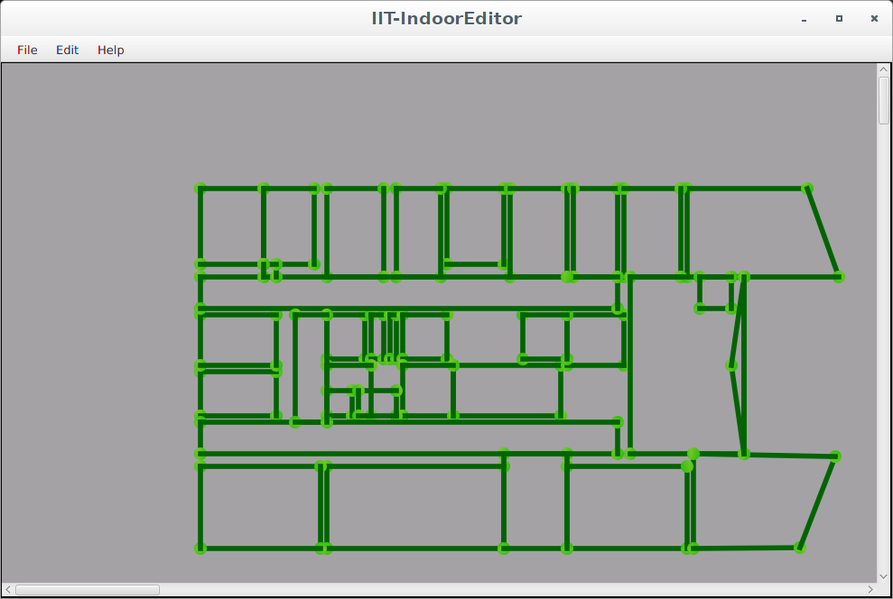
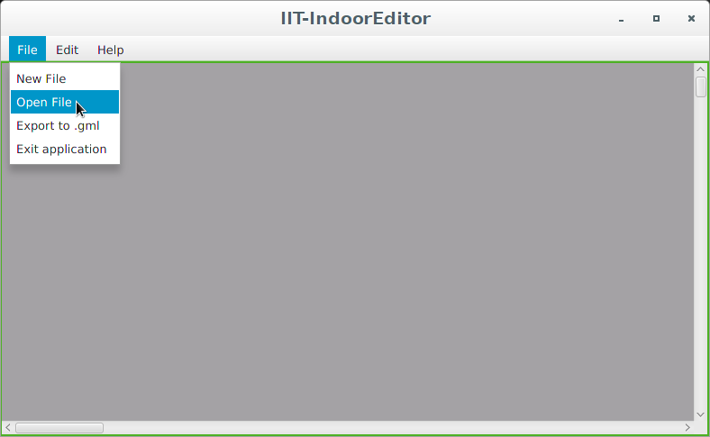
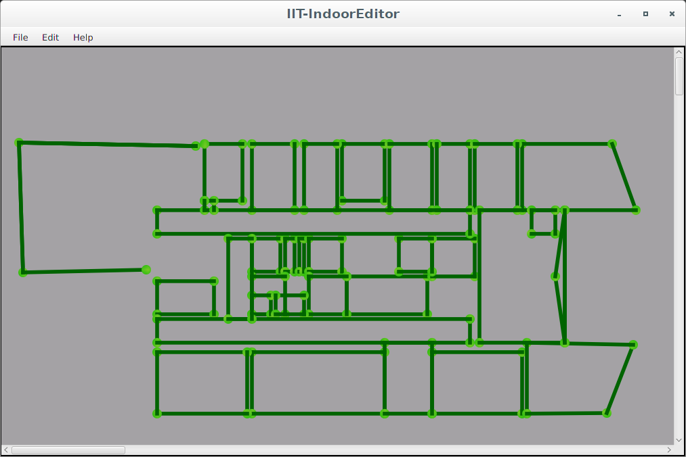
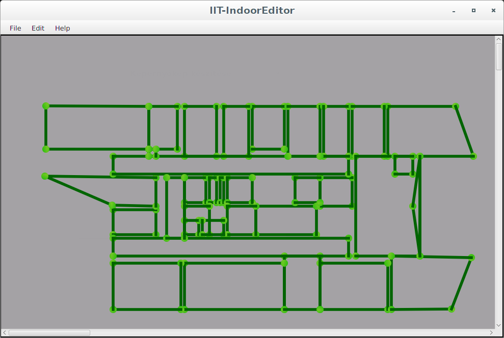

# IndoorGMLEditor

IndoorGML-Editor is a desktop Java application to edit and modify gml files based on the IndoorGML schema. IndoorGML is an OGC standard for an open data model and XML schema for indoor spatial information. With GML files you can represent floor plans of buildings and indoor environments. More information about the the IndoorGML standard:

#### Features, capabilites:
* Representation of GML files
* CellSpace creation and modification (delete, modify, extend)
* Load and save GML files

#### Technologies:
* XML
* JavaFX
* MVC model
* Java DOM

#### Requirements:

* Java 7
* Java IDE (IntelliJ, Eclipse or other)
* Maven

#### To run the code:

1. Download the source code form GitHub .
2. Import it to a Maven project using IntelliJ, Eclipse or other IDE.
   If you are using IntelliJ, be sure to mark "src" folders as Source and "resource" folders as resource
3. The application works with Java 7 and above, so modify the default JDK, if it is required.
4. Run Main.java in "gui" module.

#### Some screenshots from the program:

  
   
   
   
 
   
  

